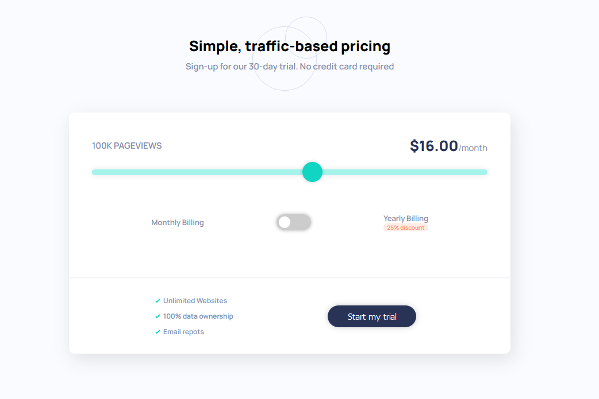
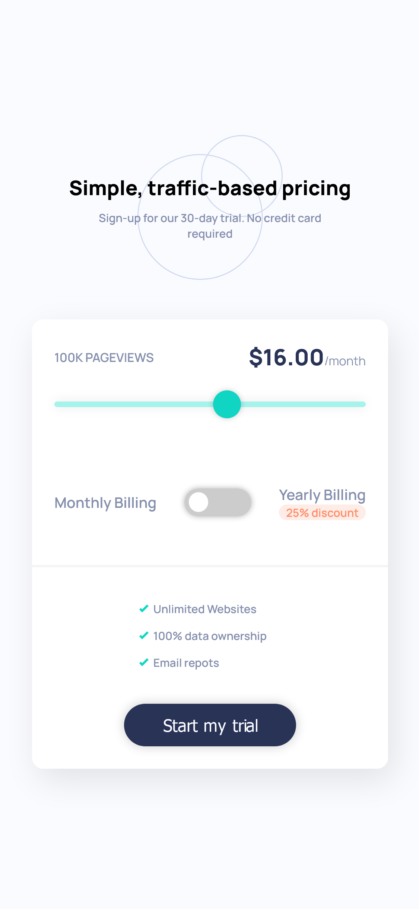

# Frontend Mentor - Interactive pricing component solution

## Table of contents

- [Overview](#overview)
  - [The challenge](#the-challenge)
  - [Screenshot](#screenshot)
  - [Links](#links)
- [My process](#my-process)
  - [Built with](#built-with)
  - [What I learned](#what-i-learned)
  - [Continued development](#continued-development)

## Overview

### The challenge

Users should be able to:

- View the optimal layout for the app depending on their device's screen size
- See hover states for all interactive elements on the page
- Use the slider and toggle to see prices for different page view numbers

### Screenshot

### Links

- Live Site URL: [https://hidalest.github.io/sliderPricingComponent/](https://hidalest.github.io/sliderPricingComponent/)

## My process

### Built with

- Semantic HTML5 markup
- CSS custom properties
- Flexbox
- CSS Grid
- Mobile-first workflow
- Vainilla JS

### What I learned

To be honest, I didn't know how to use, create or implement a slider before so this for me was a challege and I did have to do my research on the internet. For me it was a pretty awesome project to learn about this.

To see how you can add code snippets, see below:

### Continued development

This was an awesome opportunity to learn about the slider but it opened my eyes that there are a lot of components that I haven't used before. This project inspired me on continue working on these kind of projects to learn more.
ate the file path in the image above.

